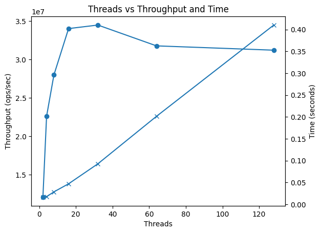

# Concurrent Hash Map

- Hash is map is widely used data structure. It allows us to store to keep data in key-value pair.
- To design such data structure, we can use separate chaining with mutex lock for each bucket.
- I have implemented this in cpp, here you can find the implementation: [concurrent-hash-map](./concurrent-hash-map.hpp)
- Here when the collision will be high, then the lock contention will increase, and there we will see the performance drop.
- One good design will be to keep the read and write locks differently.

## Performance Measure

| Threads | Total Ops | Time (s)  | Throughput (ops/sec) |
|--------|----------|-----------|----------------------|
| 2      | 200000   | 0.0165876 | 1.20572e+07          |
| 4      | 400000   | 0.0177058 | 2.25915e+07          |
| 8      | 800000   | 0.0285945 | 2.79774e+07          |
| 16     | 1600000  | 0.0470263 | 3.40235e+07          |
| 32     | 3200000  | 0.0927972 | 3.44838e+07          |
| 64     | 6400000  | 0.201442  | 3.17709e+07          |
| 128    | 12800000 | 0.410134  | 3.12093e+07          |

    
    <i>Threads vs Throughput, Time</i>

