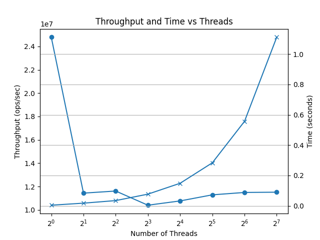
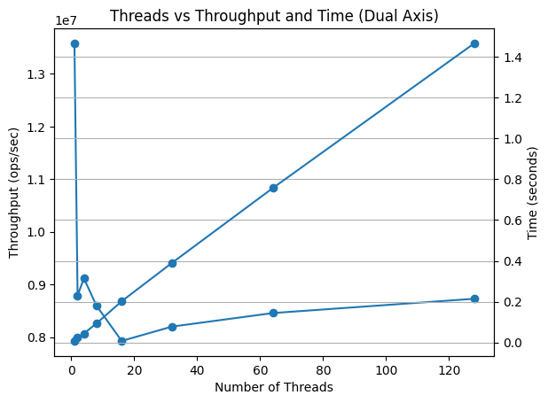

# Concurrent Linked List

- Linked list is data structure which holds the value in linear fashion.
- Simple implementation, single lock: [single-lock-linked-list](./simple-linked-list/simple-linked-list.c)
- Hand over hand Linked list impl: [hoh-linked-list](./scalable-linked-list/scalable-linked-list.c)

## Performance

### Single lock linked list

| Threads | Total Ops | Time (sec) | Throughput (ops/sec) |
|--------:|----------:|-----------:|---------------------:|
| 1       | 100,000   | 0.004034   | 24,789,290.95        |
| 2       | 200,000   | 0.017486   | 11,437,721.61        |
| 4       | 400,000   | 0.034435   | 11,616,088.28        |
| 8       | 800,000   | 0.076900   | 10,403,120.93        |
| 16      | 1,600,000 | 0.148572   | 10,769,189.35        |
| 32      | 3,200,000 | 0.283416   | 11,290,823.38        |
| 64      | 6,400,000 | 0.556791   | 11,494,438.67        |
| 128     | 12,800,000| 1.111355   | 11,517,471.91        |

---

    
    <i>Threads vs Throughput, Time</i>

### Hand over Hand lock linked list

| Threads |  Total Ops | Time (sec) | Throughput (ops/sec) |
| ------: | ---------: | ---------: | -------------------: |
|       1 |    100,000 |   0.007363 |        13,581,420.60 |
|       2 |    200,000 |   0.022761 |         8,786,960.14 |
|       4 |    400,000 |   0.043874 |         9,117,016.92 |
|       8 |    800,000 |   0.093056 |         8,596,973.86 |
|      16 |  1,600,000 |   0.201844 |         7,926,913.85 |
|      32 |  3,200,000 |   0.390268 |         8,199,493.68 |
|      64 |  6,400,000 |   0.756819 |         8,456,447.31 |
|     128 | 12,800,000 |   1.466526 |         8,728,109.83 |

    
    <i>Threads vs Throughput, Time</i>

