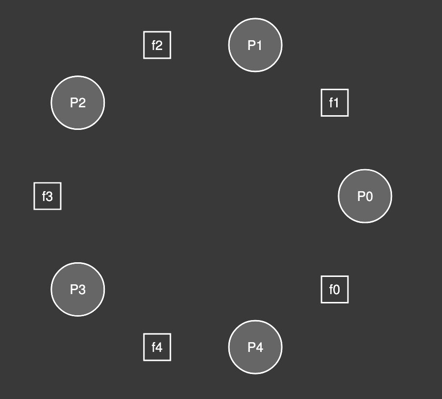

# Semaphores

- A semaphores is an object with integer value which can be used as locks as well as conditional variables.
- See how can be semaphore initialized in c: [semaphores](./code/i-semaphore-routines.c)

## Binary Semaphore(Locks)

- We can turn our semaphore into the lock. 
- Initialise semaphore with `1`, and whenever we are entering critical section, call `sem_wait`, so whenever thread will try to acquire the lock, it will execute this function, and if the value is less than 0, then it will put itself to sleep.
- For releasing the lock, call `sem_post`, this will increment the value and wake up the waiting thread.
- Since lock have binary state, 1(not held) and 0(held), thus we can use semaphore as a locks.
- But one should be vary, when should we use semaphore as lock. This doesn't have lock ownership, so it may not be safe in every case for critical section.

## Semaphores for ordering

- When thread wants to do something on specific condition, like waiting for other thread to finsh the task.
- How we can implement this ordering based events(or conditional variable behaviour) using semaphore.
- To achieve this we can initialize the semaphore with 0, and for going to sleep we can use the `sem_wait` and when other threads are done with their work and can wake up other thread then we'll call `sem_post`. In this way, the parent thread will end up waiting and child tread will wake it up.
- See the example: [semaphore-ordering]

## Producer/Consumer(Bounded buffer) Problem

- We have already seen this problem, we can use the semaphores alone to solve this problem
- Implementation: [bounder-buffer](./code/iv-producer-consumer.c)

## Reader/Writer Lock

- So, for some data structure, while inserting or removing, it's necesary to add locks, but while reading if the state has not changed then we can allow as many threads to go inside and read from the data.
- So, we can implement the lock, such that, when writers are writing the data then we will not allow any threads to do any thing, but on read lock we will allow read threads but not write threads. So in this way write thread will have to wait untill all the read threads finishes read execution.
- Now this can lead to the starvation problem for the writer, if read threads are keep coming.
- One way is to block the new reader, when writer is waiting in the queue before existing reader completes the execution.

## The dining philosophers problem

- So this is very well known problem proposed by Djikstra. 
- So we have 5 philosophers who are sitting in the round table and there are five forks which are placed beside them.

    

- Now when philosopher needs to eat, they need two forks, one in their right hand and one in their left hand.
- So if each philosopher picks up the left sided fork, then each philosopher will wait for other fork. And philosopher will only release the fork, when they are done eating.
- So here we have deadlock in this situation.

## Implementing Semaphores

- We'll implement our semaphore.
- Let's call it, jemaphore.
