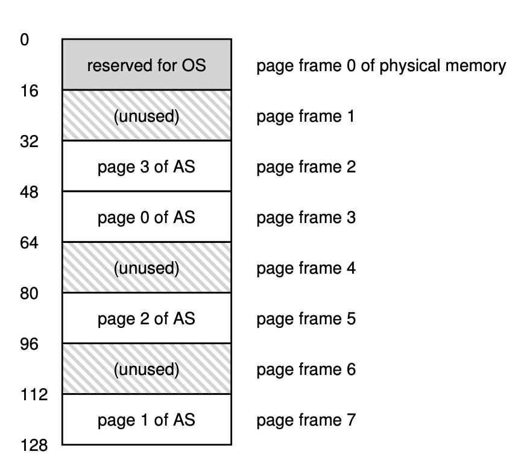

# Paging: Introduction

- Managing memory with segmentation is complex and have many difficulties. So people have discovered to divide the physical memory in pages and then map the Virtual Page to Physical Page.
- **Page**: A segment of memory, we divide it in physical memory and in virtual memory. 
- To map the virtual address to physical address efficiently we use `page table` data structure which are stored per process.
- Example of page in 64 bit system of 128 bytes memory:
<p align="center">
    
</p>
- Some memory reserved for the OS use.

## Converting Virtual Address to Physical Address

- The virtual address is split into virtual page number and offset. The offset stays the same and just a VPN changes.
- VPN can be found as -
```c
VPN = floor(virtual_address / page_size)
```
- Using VPN we will find the actual physical page from page table -
```c
physical_frame_number = page_table[VPN]
```
- And offset can be found as -
```c
offset = virtual_address % page_size
```
- And finally physical address can be found as -
```c
physical_address = (physical_frame_number * page_size) + offset
```

Ex.:
```c
Total Memory - 64 bytes
One page size - 16 bytes
Pages - 64/16 = 4

Virtual Page       Physical Frame
-----------        --------------
VP 0       →       PF 3
VP 1       →       PF 7
VP 2       →       PF 5
VP 3       →       PF 2

Converting virtual address 21 to physical address -
VPN = 21 / 16 = 1
offset = 21 % 16 = 5
physical_address = (7 * 16) + 5 = 117

Also -

VPN     offset
01      0101
 ↓
PFN     offset
111     0101

Physical address = 1110101
```

## Page Table

- For storing page information for translation, one of the data structre we use is simply array, which is called Linear Page Table.

### What we store in page table?
- A entry of page table is called PTE(page table entry), in the contents we store various bits:

- Page Table Entry (PTE):
```c
┌────────┬────────┬────────┬────────┬──────────────┐
│ Valid  │ R/W    │ U/S    │ Dirty  │     PFN      │
│        │        │        │        │              │
└────────┴────────┴────────┴────────┴──────────────┘
```

1. Physical Frame Number - The PFN tells us which physical frame contains the page.
2. Valid Bit: It tells that if the virtual address is part of the processes address space or not?
3. Protection bit: It tells about the page permission. For example, the code segment should have read and execute permission no write permission. Beacuse we don't want that process modifying it's owm machine instruction
4. R/W bit — Read/Write: It determines if writing is allowed or not
5. U/S — User/Supervisor bit: It tells about the CPU privilege level. Differet mode, user mode, sudo mode etc..
6. Present Bit: Is this page currently physically present in RAM?
7. Dirty Bit: Has this page been modified since it was loaded into RAM?
8. Accessed/Reference Bit: Has this page been accessed recently?

### Paging is slow

- The address translation requires referencing too many memory addresses. First of all it have to access the page table, then it have to find the VFN, and then it have to find the corresponding PFN, referencing the frame again.
- So it adds too much overhead for the user program referencing the addresses.
- Here is simple code implementing the address translation: [Translation using paging](./codes/paging_translation.c)